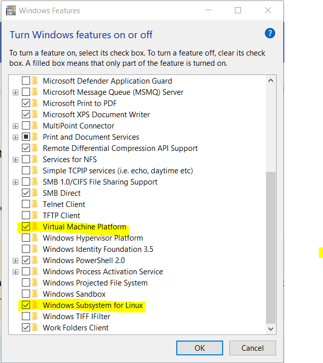
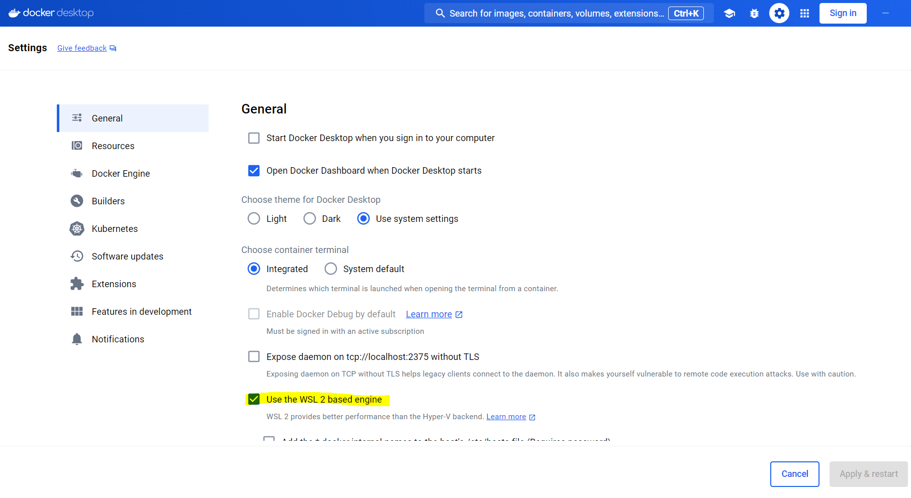

# Install Docker Desktop on Windows with WSL 2 backend

## STEPS
1. Make sure all the system requirements are met, especially turn on the following features for WSL 2 backend.
    - Virtual Machine Platform
    - Windows Subsystem for Linux
    

2. If your user account is an Administrator, follow the [instruction](https://docs.docker.com/desktop/install/windows-install/) to install Docker Desktop interactively or from the command line. 

3. If your admin account is different to your user account, you must add the user to the **docker-users** group, then
    - Run '''wsl --install''' in terminal.
    - Install Docker Desktop interactively or from the command line.

4. Make sure "User the WSL 2 based engine" is checked in Docker settings.

